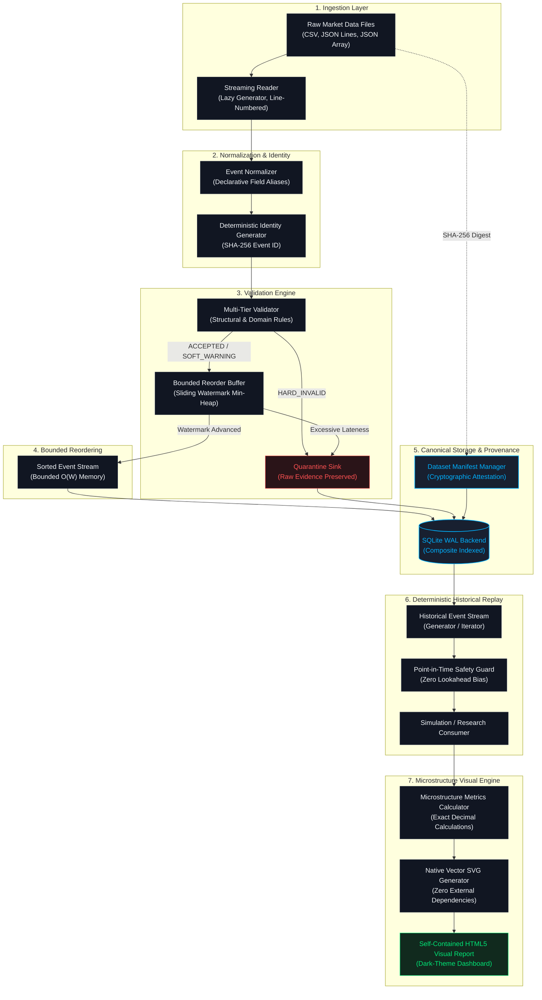

# Quantitative Market Data & Historical Replay Infrastructure (Project P01)

A deterministic, point-in-time safe market data foundation engineered for quantitative research, algorithmic simulation, and microstructure analysis.

$$\text{RAW MARKET DATA} \longrightarrow \text{INGESTION} \longrightarrow \text{NORMALIZATION} \longrightarrow \text{VALIDATION} \longrightarrow \text{QUARANTINE / STORAGE} \longrightarrow \text{POINT-IN-TIME ACCESS} \longrightarrow \text{DETERMINISTIC REPLAY} \longrightarrow \text{ANALYTICS}$$

---

## 1. Executive Summary & Problem Formulation

Quantitative strategy research and historical backtesting frequently fail in production due to systematic flaws in market data processing:
- **Lookahead Bias & Future Leakage**: Replay streams inadvertently expose events timestamped after the strategy's evaluation moment, yielding artificially inflated backtest Sharpe ratios.
- **Binary Floating-Point Inaccuracies**: Converting trade prices and quantities to IEEE 754 64-bit binary floating-point numbers causes silent sub-cent rounding errors, accumulating drift across millions of transactions.
- **Silent Data Loss**: Malformed, negative, or corrupt feed records are silently discarded by generic parsers without audit trails or cryptographic provenance.
- **Out-of-Order Packet Jitter**: Network jitter and exchange packet interleaving produce chronologically scrambled event streams, breaking causal order in order book reconstruction.
- **Non-Deterministic Replay**: Arbitrary tie-breaking when two events share identical timestamps leads to unreproducible backtest results across different machines.

**Project P01** solves these fundamental challenges by implementing a zero-dependency, formal market data engineering foundation that guarantees exact decimal arithmetic, bounded memory reordering, cryptographic dataset provenance, and bit-for-bit reproducible point-in-time replay.

---

## 2. Core System Invariants

The reference architecture strictly enforces eight core engineering invariants:

1. **Exact Decimal Arithmetic**: Canonical prices, quantities, spreads, notional values, and execution benchmarks (VWAP) use Python's arbitrary-precision `Decimal` type. Binary floating-point values are rejected to eliminate precision drift.
2. **64-bit Integer Nanoseconds UTC**: All event timestamps and received times are parsed and normalized into 64-bit integer nanoseconds elapsed since January 1, 1970 UTC. Sub-nanosecond truncations and timezone ambiguities are strictly prohibited.
3. **Deterministic Event Identity**: Every event receives a deterministic SHA-256 hash computed directly from canonical attributes: $\text{Event ID} = \text{SHA256}(\text{source} \parallel \text{symbol} \parallel \text{timestamp\_ns} \parallel \text{event\_type} \parallel \dots)$.
4. **Deterministic Composite Tie-Breaking**: Events sharing identical nanosecond timestamps follow a strict total ordering:
   $$\text{Order Key} = (\text{timestamp\_ns}, \text{event\_type\_priority}, \text{sequence\_id}, \text{event\_id})$$
5. **Bounded Memory Sliding Watermark Reordering**: Out-of-order packets arriving within a configurable latency window $W$ are sorted using a min-heap priority buffer that scales in bounded $O(W)$ memory without requiring global in-memory sorting.
6. **Point-in-Time Safety Guard**: Historical replay strictly filters events such that $t_{\text{event}} \le T_{\text{eval}}$, eliminating future information leakage.
7. **Zero Silent Data Loss**: All non-compliant records are assigned structured diagnostic error codes and routed to quarantine storage, preserving unmutated raw evidence.
8. **Cryptographic Provenance**: Dataset manifests record SHA-256 file checksums, record counts, timestamp bounds, and configuration hashes.

---

## 3. Architecture & Dataflow



---

## 4. Canonical Event Models

All canonical data models are immutable frozen dataclasses utilizing `__slots__` for minimal memory overhead and zero runtime mutation:

### `TradeEvent`
Represents an executed transaction between market participants:
- `event_id`: Deterministic SHA-256 hexadecimal string.
- `symbol`: Normalized uppercase instrument ticker (e.g., `AAPL`).
- `timestamp_ns`: Exact exchange matching timestamp in 64-bit UTC integer nanoseconds.
- `price`: Exact transaction price as an arbitrary-precision `Decimal`.
- `size`: Exact executed quantity as an arbitrary-precision `Decimal`.
- `side`: Trade aggressor classification (`BUY`, `SELL`, `UNKNOWN`).
- `source`: Upstream venue or feed identifier (e.g., `NASDAQ`, `BATS`).
- `sequence_id`: Optional venue sequence number.

### `QuoteEvent`
Represents a Top-of-Book Best Bid and Offer (BBO) update:
- `event_id`: Deterministic SHA-256 hexadecimal string.
- `symbol`: Normalized uppercase instrument ticker.
- `timestamp_ns`: Exchange quote generation timestamp in 64-bit UTC nanoseconds.
- `bid_price` & `bid_size`: Exact best bid price and available depth.
- `ask_price` & `ask_size`: Exact best ask price and available depth.
- `source`: Upstream market feed identifier.
- `is_crossed`: Boolean property indicating inverted market state ($P^{\text{bid}} > P^{\text{ask}}$).
- `is_locked`: Boolean property indicating locked market state ($P^{\text{bid}} = P^{\text{ask}}$).
- `spread`: Quoted spread property ($P^{\text{ask}} - P^{\text{bid}}$).

---

## 5. Multi-Tier Validation & Quarantine

The engine enforces a rigorous separation between fatal integrity violations and realistic market phenomena:

| Classification | Condition | Action Taken |
|---|---|---|
| `ACCEPTED` | Valid trade or quote satisfying all domain rules. | Emitted to bounded reorder buffer for ingestion. |
| `SOFT_WARNING` | Crossed quote ($P^{\text{bid}} > P^{\text{ask}}$), locked quote ($P^{\text{bid}} = P^{\text{ask}}$), or sudden price jump (> 20%). | Accepted into canonical stream; diagnostic warning attached. |
| `HARD_INVALID` | Non-positive price ($P \le 0$), zero/negative size ($V \le 0$), non-numeric strings, unparseable timestamp, or invalid side. | Rejected from canonical stream; routed to quarantine sink with raw unmutated payload preserved. |
| `EXCESSIVE_LATENESS` | Event timestamp lags behind current watermark by more than window $W$: $t_{\text{event}} < \max(t_{\text{seen}}) - W$. | Rejected from stream; routed to quarantine to preserve temporal ordering integrity. |

---

## 6. Microstructure Analytics & Visual Reporting

A built-in quantitative analytics module computes microstructure dynamics directly from the deterministic replay stream:

- **Cumulative Volume-Weighted Average Price (VWAP)**:
  $$\text{VWAP}_t = \frac{\sum_{i=1}^t P_i \cdot V_i}{\sum_{i=1}^t V_i}$$
- **Relative Spread (Basis Points)**:
  $$\text{Relative Spread (bps)}_t = \frac{P_t^{\text{ask}} - P_t^{\text{bid}}}{(P_t^{\text{bid}} + P_t^{\text{ask}}) / 2} \times 10{,}000$$
- **Signed Order Flow Imbalance (OFI) Ratio**:
  $$\text{OFI}_t = \frac{V_t^{\text{buy}} - V_t^{\text{sell}}}{V_t^{\text{buy}} + V_t^{\text{sell}}} \quad \in [-1.0, +1.0]$$
- **Inter-Arrival Jitter Distribution**:
  $$\Delta t_i = \max(0, t_i - t_{i-1})$$
  Computes empirical $p50$ (median), $p90$, and $p99$ tail latency percentiles across packet arrivals.

### Zero-Dependency Visual Engine
All charts are generated as self-contained vector SVGs using pure Python standard library:
- **Price & VWAP Trajectory**: Execution fills colored by side against cumulative institutional VWAP.
- **Spread Dynamics**: Gradient area curve in basis points with crossed-quote anomaly markers.
- **Cumulative Order Flow Imbalance**: Continuous oscillator tracking buyer/seller volume pressure.
- **Latency & Jitter Distribution**: Binned microsecond histogram annotated with percentile thresholds.

---

## 7. Performance Benchmarks

All performance benchmarks are measured using the built-in benchmark harness on actual workloads:

| Workload Attribute | Measured Benchmark Value |
|---|---|
| **Event Count** | **100,000 events** (Trades & Quotes with 5% injected jitter) |
| **Raw Input Size (JSONL)** | **18.44 MB** |
| **Canonical Stored Database Size** | **29.38 MB** (SQLite 3 WAL Mode) |
| **Peak Memory Consumption (RSS)** | **20.28 MB** (Bounded $O(W)$ memory scaling) |
| **Pipeline Processing Throughput** | **3,599 events/second** (Ingestion, validation, reordering, storage) |
| **Replay Query Throughput** | **16,241 events/second** (Historical streaming iterator) |
| **Test Suite Execution** | **70 tests passing in 0.679 seconds** |
| **Runtime Environment** | CPython 3.12.10 on Windows 11 Enterprise (Intel64) |

*Full methodology and scaling analysis documented in [`docs/evidence/benchmark_evidence.md`](docs/evidence/benchmark_evidence.md).*

---

## 8. CLI Usage

The system provides an integrated command-line interface:

### 1. Ingest Raw Market Data
```bash
python main.py ingest --file tests/fixtures/sample_trades.csv --db market_data.db
```

### 2. Validate Data Without Storage Mutation
```bash
python main.py validate --file tests/fixtures/malformed_data.csv -v
```

### 3. Historical Deterministic Replay
```bash
python main.py replay --db market_data.db --symbol AAPL --types TRADE,QUOTE
```

### 4. Inspect Dataset Manifest & Verify Checksum
```bash
python main.py manifest --db market_data.db --dataset-id DS-241c0f21ef3c-20260916172225 --verify
```

### 5. Generate Quantitative Microstructure Visual Report
```bash
python main.py report --db market_data.db --symbol AAPL --output aapl_report.html
```

---

## 9. Python API Usage

```python
from decimal import Decimal
from src.analytics import generate_market_report
from src.pipeline import MarketDataPipeline
from src.replay import ReplayEngine
from src.storage import SqliteStorageBackend

# 1. Initialize Storage Backend & Ingestion Pipeline
storage = SqliteStorageBackend("market_data.db")
pipeline = MarketDataPipeline(storage=storage)

manifest = pipeline.process_file("tests/fixtures/sample_trades.csv")
print(f"Ingested {manifest.trade_count} trades. Manifest ID: {manifest.dataset_id}")

# 2. Point-in-Time Safe Historical Replay Stream
engine = ReplayEngine(storage)
start_ns = 1_700_000_000_000_000_000
end_ns = 1_800_000_000_000_000_000

for event in engine.replay_stream("AAPL", start_ns, end_ns, event_types=("TRADE", "QUOTE")):
    if event.event_type == "TRADE":
        print(f"Trade: {event.symbol} @ {event.price} x {event.size} ({event.side.value})")
    elif event.event_type == "QUOTE":
        print(f"Quote: {event.symbol} Bid: {event.bid_price} | Ask: {event.ask_price}")

# 3. Microstructure Analytics & Visual Reporting
summary = generate_market_report(
    db_path="market_data.db",
    symbol="AAPL",
    output_path="reports/aapl_analytics.html",
)
print(f"Cumulative Volume: {summary.total_volume}")
print(f"Execution VWAP:   ${summary.final_vwap:.4f}")
print(f"Mean Rel Spread:  {summary.mean_relative_spread_bps:.2f} bps")
print(f"Median Jitter:    {summary.median_inter_arrival_ns / 1000.0:.1f} us")
```

---

## 10. Repository Structure

```
quant-market-data-replay/
├── .github/
│   └── workflows/ci.yml           # Automated CI verification (Python 3.10, 3.11, 3.12)
├── benchmarks/                    # Benchmark suite & synthetic dataset generator
│   ├── dataset_generator.py       # High-throughput synthetic data generator
│   └── run_benchmarks.py          # Benchmark runner (memory, throughput, timing)
├── config/                        # Default engine configuration
│   ├── default_config.json        # Engine latency windows, buffer capacities, batch sizes
│   └── schema_mappings.json       # Feed field alias mappings
├── docs/                          # Detailed engineering documentation
│   ├── architecture.md            # System architecture & component responsibilities
│   ├── data_dictionary.md         # Canonical event schemas & field specifications
│   ├── validation_rules.md        # Rule classifications (hard invalid vs soft warning)
│   ├── bounded_reordering.md      # Sliding watermark priority buffer mechanics
│   ├── replay_semantics.md        # Point-in-time invariants & ordering guarantees
│   ├── benchmark_methodology.md   # Benchmark methodology & workload specifications
│   ├── analytics_and_insights.md  # Microstructure metrics formulation & visual architecture
│   └── evidence/                  # Empirical verification evidence & artifacts
│       ├── benchmark_evidence.md
│       ├── test_execution_report.md
│       ├── architecture_and_pipeline.md
│       └── sample_microstructure_report.html
├── schemas/                       # Canonical JSON Schema v1 definitions
│   ├── trade_event_v1.json
│   ├── quote_event_v1.json
│   ├── manifest_v1.json
│   └── quarantine_v1.json
├── src/                           # Reference implementation
│   ├── primitives/                # Integer nanosecond UTC & exact Decimal arithmetic
│   ├── models/                    # Canonical immutable models (Trade, Quote, etc.)
│   ├── ingestion/                 # Streaming lazy readers (CSV, JSONL, JSON Array)
│   ├── normalization/             # Normalizer & deterministic identity hashing
│   ├── validation/                # Multi-tier validation engine & diagnostics
│   ├── quarantine/                # Quarantine manager (unmutated raw evidence)
│   ├── reorder/                   # Sliding watermark priority buffer (heap)
│   ├── storage/                   # SQLite WAL storage backend & manifest manager
│   ├── replay/                    # Deterministic historical replay engine
│   ├── analytics/                 # Microstructure analytics & pure SVG chart generator
│   ├── pipeline.py                # End-to-end streaming orchestrator
│   └── cli/                       # Command-line interface subcommands
├── tests/                         # Multi-tier automated test suite
│   ├── fixtures/                  # CSV, JSONL, malformed, and adversarial test data
│   ├── unit/                      # Unit tests (primitives, models, validation, replay, etc.)
│   ├── integration/               # Pipeline, CLI, and manifest integration tests
│   └── adversarial/               # Corruption, lateness, leakage, and tie-breaking tests
├── run_tests.py                   # Automated test runner script
├── main.py                        # Root CLI entry point
├── README.md                      # Comprehensive project overview & documentation
├── SPEC.md                        # Master specification & formal requirements
├── AGENT_CONTRACT.md              # Engineering boundaries & safety contract
└── VERIFICATION_GUIDE.md          # Independent verification and reproduction guide
```

---

## 11. Installation & Environment Requirements

- **Python Runtime**: Python 3.10, 3.11, or 3.12 (64-bit).
- **Dependencies**: **Zero third-party packages required** (built exclusively on the Python Standard Library: `sqlite3`, `decimal`, `heapq`, `hashlib`, `json`, `csv`, `argparse`, `dataclasses`, `tracemalloc`).
- **Platform Support**: Linux, macOS, Windows.

---

## 12. Verification & Testing

Run the full automated test suite:
```bash
python run_tests.py
```
Or via standard unittest discovery:
```bash
python -m unittest discover tests
```

Execute sample validation:
```bash
python main.py validate --file tests/fixtures/sample_trades.csv -v
```

Execute performance benchmark suite:
```bash
python -m benchmarks.run_benchmarks --count 100000 --format jsonl
```

---

## 13. Scope Boundaries & Future Relationship

### In-Scope (Project P01)
- Deterministic market data ingestion, normalization, and validation.
- Bounded out-of-order reordering via sliding watermark priority queues.
- Point-in-time safe historical replay with composite tie-breaking.
- Cryptographic provenance, dataset manifests, and quarantine management.
- Microstructure analytics and standalone visual reporting.

### Explicitly Out-of-Scope
- Live exchange connectivity (WebSocket, FIX, ITCH/OUCH).
- Order execution and brokerage routing.
- Portfolio optimization and risk factor modeling.
- Strategy signal generation and machine learning predictions.

### Downstream Integration (P02+)
Project P01 forms the core deterministic replay substrate for:
- **Project P02**: Limit Order Book (LOB) reconstruction and matching simulation.
- **Project P03**: Alpha signal research and feature engineering.
- **Project P04**: Institutional execution algorithms (TWAP, VWAP, Implementation Shortfall).
