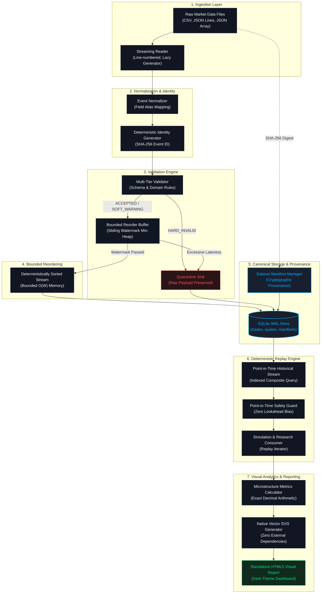

# System Architecture & Pipeline Dataflow

This document visualizes the complete end-to-end dataflow and architectural components of the **Quantitative Market Data & Historical Replay Infrastructure**.

---

## 1. High-Level Ingestion & Replay Pipeline



---

## 2. Component Directory Architecture

```
quant-market-data-replay/
├── .github/
│   └── workflows/ci.yml           # Automated CI verification across Python 3.10-3.12
├── benchmarks/                    # Benchmarking suite & synthetic generator
│   ├── dataset_generator.py       # High-throughput synthetic market generator
│   └── run_benchmarks.py          # Benchmark runner (memory, throughput, timing)
├── config/                        # Default engine configuration
│   ├── default_config.json        # Buffer capacity, watermark lateness, batch sizes
│   └── schema_mappings.json       # Feed alias mappings (e.g. qty -> size)
├── docs/                          # Detailed engineering documentation
│   ├── architecture.md            # System design & component responsibilities
│   ├── data_dictionary.md         # Canonical event schemas & field specifications
│   ├── validation_rules.md        # Rule classifications (hard vs soft)
│   ├── bounded_reordering.md      # Sliding watermark heap mechanics & proofs
│   ├── replay_semantics.md        # Point-in-time invariants & ordering guarantees
│   ├── benchmark_methodology.md   # Workload profiles & hardware testing methodology
│   ├── analytics_and_insights.md  # Mathematical formulations of microstructure metrics
│   └── evidence/                  # Empirical verification evidence & artifacts
│       ├── benchmark_evidence.md
│       ├── test_execution_report.md
│       ├── architecture_and_pipeline.md
│       └── sample_microstructure_report.html
├── schemas/                       # Canonical JSON Schema v1 definitions
│   ├── trade_event_v1.json
│   ├── quote_event_v1.json
│   ├── manifest_v1.json
│   └── quarantine_v1.json
├── src/                           # Reference implementation
│   ├── primitives/                # Integer nanosecond UTC & exact Decimal arithmetic
│   ├── models/                    # Immutable canonical models (Trade, Quote, etc.)
│   ├── ingestion/                 # Lazy streaming readers (CSV, JSONL, JSON Array)
│   ├── normalization/             # Normalizer & deterministic identity hashing
│   ├── validation/                # Multi-tier validation engine & diagnostics
│   ├── quarantine/                # Quarantine manager (unmutated raw evidence)
│   ├── reorder/                   # Sliding watermark priority buffer (heap)
│   ├── storage/                   # SQLite WAL backend & dataset manifest manager
│   ├── replay/                    # Point-in-time deterministic historical replay engine
│   ├── analytics/                 # Microstructure analytics & pure SVG chart generator
│   ├── pipeline.py                # End-to-end streaming orchestrator
│   └── cli/                       # Command-line interface subcommands
├── tests/                         # Multi-tier automated test suite
│   ├── fixtures/                  # CSV, JSONL, malformed, and adversarial test data
│   ├── unit/                      # Unit tests (primitives, models, validation, replay, etc.)
│   ├── integration/               # Pipeline, CLI, and manifest integration tests
│   └── adversarial/               # Corruption, lateness, leakage, and tie-breaking tests
├── run_tests.py                   # Automated test runner script
├── main.py                        # Root CLI entry point
├── README.md                      # Comprehensive project overview & documentation
└── VERIFICATION_GUIDE.md          # Independent verification and reproduction guide
```

---

## 3. Core Architectural Guarantees

1. **Zero Binary Floating-Point Contamination**:
   All financial fields (`price`, `size`, `bid_price`, `ask_price`, `quoted_spread`, `relative_spread`, `VWAP`) strictly utilize Python's `Decimal` type. Passing a binary float raises an immediate error unless explicit string coercion is performed.

2. **64-bit Integer UTC Nanoseconds**:
   Timestamps are uniformly stored and manipulated as integer nanoseconds elapsed since January 1, 1970 UTC. Sub-nanosecond rounding and timezone ambiguities are strictly eliminated.

3. **Deterministic Identity & Provenance**:
   Event IDs are generated via SHA-256 hashes of canonical key fields:
   $$\text{Event ID} = \text{SHA256}(\text{source} \parallel \text{symbol} \parallel \text{timestamp\_ns} \parallel \text{event\_type} \parallel \dots)$$
   Dataset manifests cryptographically attest to the raw source file checksum, configuration hash, and record counts.

4. **Bounded Memory Scaling ($O(W)$)**:
   The sliding watermark buffer holds only events within the configured lateness window $W$:
   $$\tau = \max(t_{\text{seen}}) - W$$
   Events with $t \le \tau$ are immediately flushed to persistent storage, ensuring memory consumption remains constant regardless of dataset size.

5. **Zero Lookahead Bias During Historical Simulation**:
   The point-in-time replay engine guarantees that a model evaluating at timestamp $T_{\text{eval}}$ can only observe events where:
   $$t_{\text{event}} \le T_{\text{eval}}$$
   Any subsequent event is strictly filtered out at the query level.
